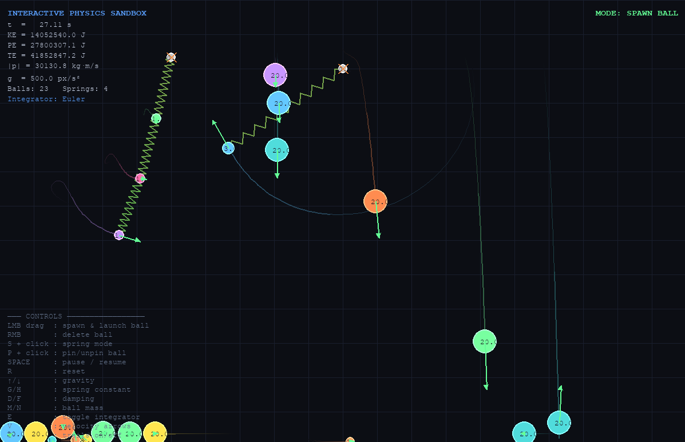
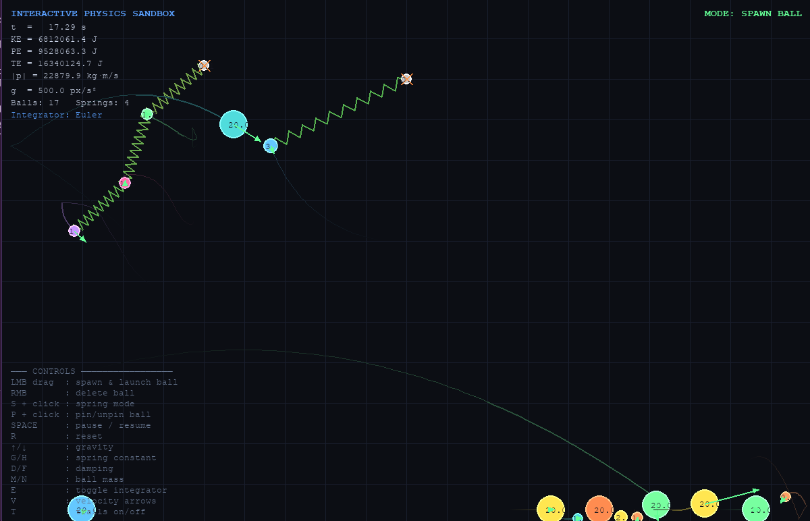
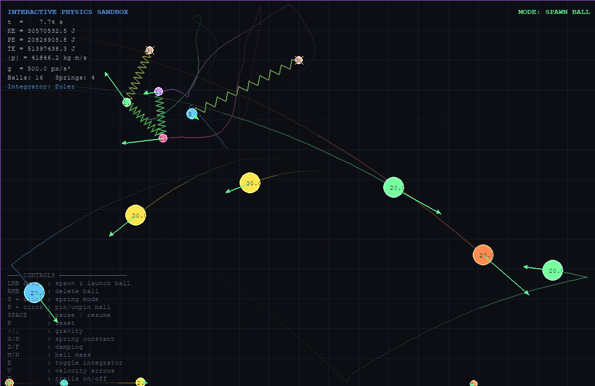
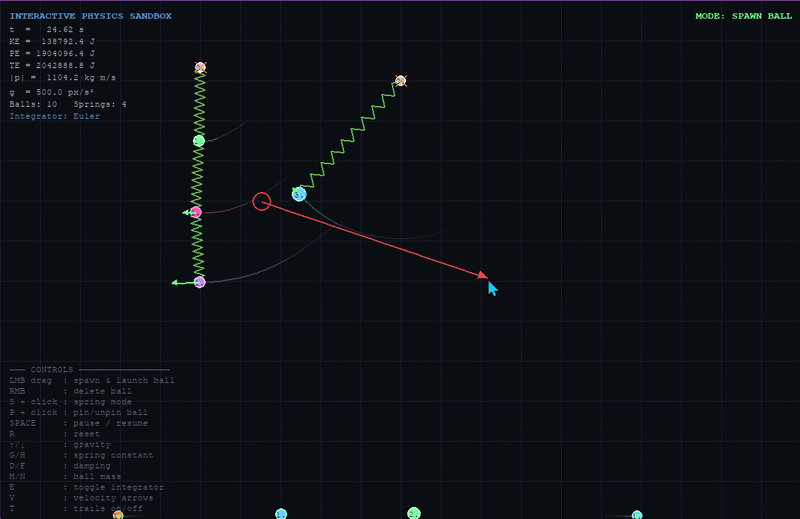

# Interactive Physics Sandbox

A 2D physics simulation built in Python for a bachelor-level mechanics and mathematical modeling portfolio.

The project focuses on:
* classical mechanics
* numerical simulation
* collision physics
* spring dynamics

---

## Features

* Gravity simulation
* Elastic collisions
* Spring mechanics with damping
* Real-time physics updates
* Energy and momentum calculations
* Euler and RK4 integration methods
* Interactive object spawning

---

## Physics Concepts

Newton’s Second Law:
F=ma

Hooke’s Law:

F=-kx

Momentum Conservation:
m_1u_1+m_2u_2=m_1v_1+m_2v_2

---
## Numerical Methods

The simulation uses:

* Semi-Implicit Euler Integration
* Runge–Kutta 4 (RK4)

for stable real-time motion simulation.

---

## Screenshots

### Gravity Simulation

### Collision Physics

### Spring Mechanics

---

## Demo GIF

## software used

* Python
* pygame
* numpy
* matplotlib
